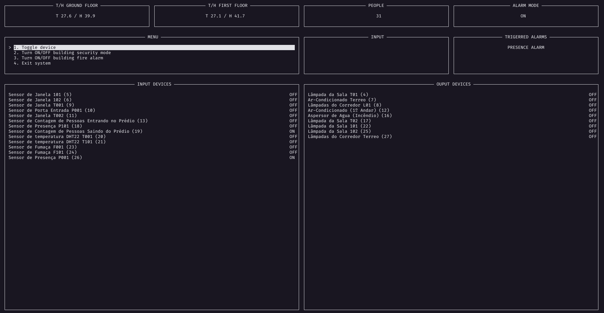

# Sistema de Automação Predial

## Objetivos

Este sistema consiste em um _software_ de automação predial desenvolvido como requisito de aprovação da matéria de Fundamentos de Sistemas Embarcados (2021/1) sob orientação do professor Renato Coral. Este sistema consiste em um sistema distribuido que capta informações de sensores externos (presença, fumaça, etc.) e reportam ao um servidor central que é o responsável pela automação de respostas necessárias aos eventos. O esquema abaixo exemplifica a arquitetura do sistema:


O ambiente em questão é a simulação de um prédio com dois pavimentos, térreo e primeiro andar, como mostra a figura abaixo.


## Como executar

Dê o clone no repositório

```bash
    git clone https://github.com/rogerioo/Embarcados_Projeto02.git
```

Entre na pasta do _servidor Central_

```bash
    cd Embarcados_Projeto02/client
```

Compile os executáveis do _servidor Central_

```bash
    make
```

Abra um terminal para deixar em execução o _servidor Central_

```bash
    make run
```

Entre na pasta do _servidor Distribuido_

```bash
    cd Embarcados_Projeto02/server
```

Compile os executáveis do _servidor Distribuido_

```bash
    make
```

Abra dois terminais para deixar em execução os dois _servidores Distribuidos_, sendo um para o térreo e outro para o primeiro andar

```bash
    make run 0
    make run 1
```

## Interface



## Entradas e Saídas

Todos os sensores são conectados as portas GPIO do ambiente do **servidor distribuído**.

## Módulos do Sistema

| Item                                             | Sigla  | GPIO | Direção |
| ------------------------------------------------ | :----: | :--: | :-----: |
| **_Andar Terreo_**                               |        |      |         |
| Lâmpada da Sala T01                              | LS_T01 |  04  |  Saída  |
| Lâmpada da Sala T02                              | LS_T02 |  17  |  Saída  |
| Lâmpadas do Corredor Terreo                      |  LC_T  |  27  |  Saída  |
| Ar-Condicionado Terreo                           |  AC_T  |  07  |  Saída  |
| Sensor de Presença                               |  SP_T  |  26  | Entrada |
| Sensor de Fumaça                                 |  SF_T  |  23  | Entrada |
| Sensor de Janela T01                             | SJ_T01 |  09  | Entrada |
| Sensor de Janela T02                             | SJ_T02 |  11  | Entrada |
| Sensor de Porta Entrada                          | SPo_T  |  10  | Entrada |
| Sensor de Contagem de Pessoas Entrando no Prédio | SC_IN  |  13  | Entrada |
| Sensor de Contagem de Pessoas Saindo do Prédio   | SC_OUT |  19  | Entrada |
| Aspersores de Água (Incêndio)                    |  ASP   |  16  |  Saída  |
| Sensor DHT22                                     |  DHT1  |  20  | Entrada |
| **_Primeiro Andar_**                             |        |      |         |
| Lâmpada da Sala 101                              | LS_101 |  22  |  Saída  |
| Lâmpada da Sala 102                              | LS_102 |  25  |  Saída  |
| Lâmpadas do Corredor                             |  LC_1  |  08  |  Saída  |
| Ar-Condicionado (1º Andar)                       |  AC_1  |  12  |  Saída  |
| Sensor de Presença                               |  SP_1  |  18  | Entrada |
| Sensor de Fumaça                                 |  SF_1  |  24  | Entrada |
| Sensor de Janela 101                             |  SJ_1  |  05  | Entrada |
| Sensor de Janela 102                             |  SJ_1  |  06  | Entrada |
| Sensor DHT22                                     |  DHT2  |  21  | Entrada |

## Referências

- [Exemplo de uso do DHT22](https://github.com/nebulx29/dht22)
- [JSON for Modern C++](https://github.com/nlohmann/json)
- [Socket Programming in C/C++](https://www.geeksforgeeks.org/socket-programming-cc/)
- [WiringPi](http://wiringpi.com/)
